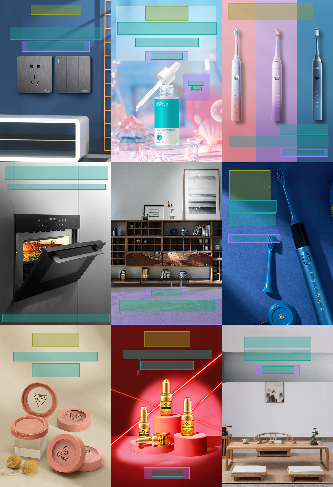

# PosterLlama

# Unconditional Generated Output



# Setup
```bash
conda create -n PosterLlama python==3.9
conda activate PosterLlama
conda install pytorch==2.0.1 torchvision==0.15.2 torchaudio==2.0.2 pytorch-cuda=11.7 -c pytorch -c nvidia

pip install requirments.txt
```

## Model Preparation
We utilize [LLaMA2-7B-chat](https://huggingface.co/meta-llama/Llama-2-7b-chat-hf) and [CodeLLaMA-7B](https://huggingface.co/codellama/CodeLlama-7b-hf) as our backbone.
You can download the models and place them under the ``./models`` directory.
For training and test about our models, backbone weight is essentiable.


Our pretrained Model of PosterLlama is here.: [PosterLlama](http) 


## Testing
The 


# Training & Preparing Dataset.
Basic setting is about dino+code_llama model.
For diverse training, you can choose more setup at ``./src/common/configs*.py``

### First-Stage Training
For first stage training, we use the filtered synthetic captions prepared by MiniGPT-4. For more detailes about the dataset, please refer to [MiniGPT-4](https://github.com/Vision-CAIR/MiniGPT-4/blob/main/dataset/README_1_STAGE.md)

The final dataset structure is shown like this.
After download, you must set ``config.train_img_path`` and ``config.val_img_path`` variable of ``configs_stage1*.py`` to the dataset path for training. 

```
.
├── ${MINIGPT4_DATASET}
│   ├── cc_sbu
│       ├── convert_cc_sbu.py
│       ├── download_cc_sbu.sh
│       ├── ccs_synthetic_filtered_large.json
│       ├── ccs_synthetic_filtered_large.tsv
│       └── cc_sbu_dataset
│           ├── 00000.tar
│           ├── 00000.parquet
│           ...
│   ├── laion
│       ├── convert_laion.py
│       ├── download_laion.sh
│       ├── laion_synthetic_filtered_large.json
│       ├── laion_synthetic_filtered_large.tsv
│       └── laion_dataset
│           ├── 00000.tar
│           ├── 00000.parquet
│           ...
...   
```
After download dataset. Below is training script.

```bash

CUDA_VISIBLE_DEVICES=2,5 accelerate launch --num_processes=2 --gpu_ids="all" main.py --config src/common/configs_stage1_dino_codellama.py --workdir train_stage1_dino_code_llama

```

### Second-Stage Training
For second stage training, we utilize deepspeed stage-2. So before training, we recommend to setup the accelerate config.
```bash

 DS_SKIP_CUDA_CHECK=1 CUDA_VISIBLE_DEVICES=0,1 accelerate launch --num_processes=2 --gpu_ids='all'  main.py  --config src/common/configs_stage2_dino_code_llama.py --workdir train_stage2_with_augment_dino_codellama

```