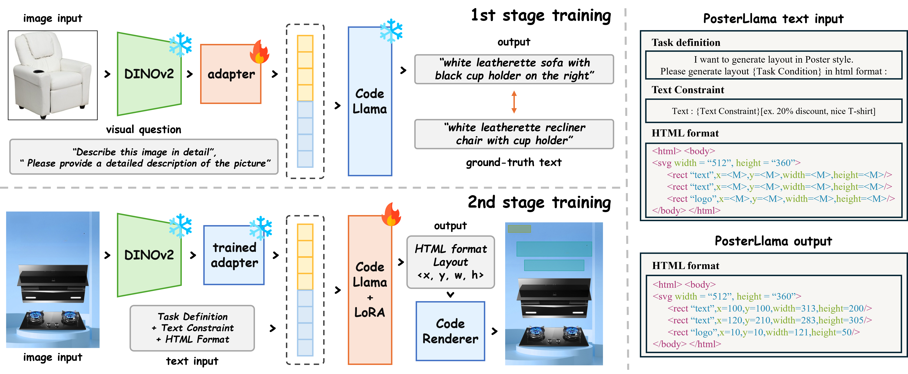
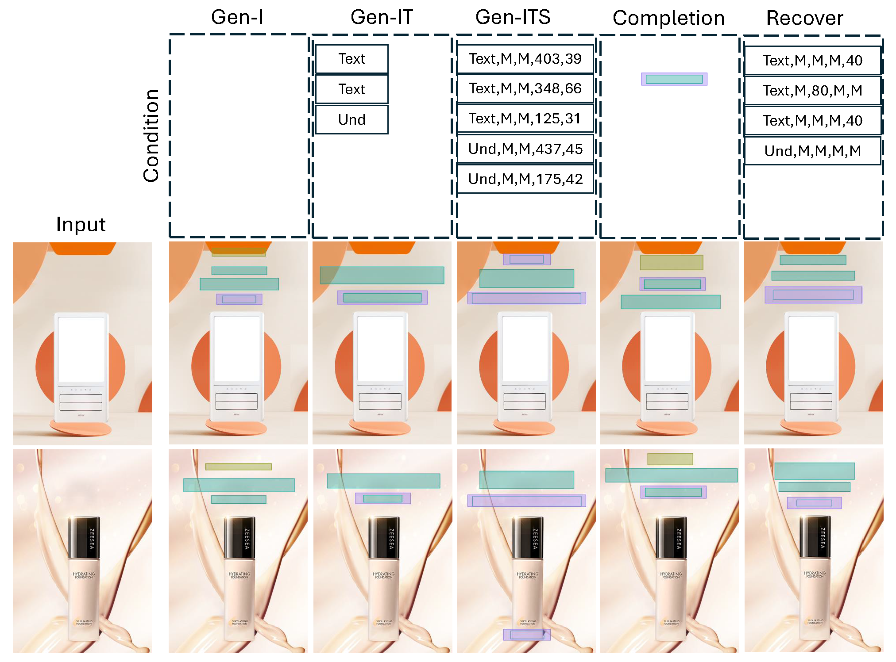

# PosterLlama: Bridging Design Ability of Language Model to Content-Aware Layout Generation

Authors : Jaejung Seol, SeoJun Kim, [Jaejun Yoo](https://scholar.google.co.kr/citations?hl=en&user=7NBlQw4AAAAJ)

## 📌 News 📌
[2024.07.02] - 🎊 **PosterLlama** has been accepted by ECCV 2024! 🎊

## Abstract
> Visual layout plays a critical role in graphic design fields such as advertising, posters, and web UI design.  
The recent trend towards content-aware layout generation through generative models has shown promise, yet it often overlooks the semantic intricacies of layout design by treating it as a simple numerical optimization. 
To bridge this gap, we introduce PosterLlama, a network designed for generating visually and textually coherent layouts by reformatting layout elements into HTML code and leveraging the rich design knowledge embedded within language models. 
Furthermore, we enhance the robustness of our model with a unique depth-based poster augmentation strategy. This ensures our generated layouts remain semantically rich but also visually appealing, even with limited data. 
Our extensive evaluations across several benchmarks demonstrate that PosterLlama outperforms existing methods in producing authentic and content-aware layouts. It supports an unparalleled range of conditions, including but not limited to content-aware layout generation, element conditional layout generation, and layout completion, among others, serving as a highly versatile user manipulation tool.

## Overview of PosterLlama



## Examples
### Conditional Generation
 

<details>
<summary>Demo Generated Samples</summary>

</details>

<br/>
  
# Setup
```bash
conda create -n PosterLlama python==3.9
conda activate PosterLlama
conda install pytorch==2.0.1 torchvision==0.15.2 torchaudio==2.0.2 pytorch-cuda=11.7 -c pytorch -c nvidia

pip install requirments.txt
```

## Model Preparation
We utilize [LLaMA2-7B-chat](https://huggingface.co/meta-llama/Llama-2-7b-chat-hf) and [CodeLLaMA-7B](https://huggingface.co/codellama/CodeLlama-7b-hf) as our backbone.
You can download the models and place them under the ``./models`` directory.
For training and test about our models, backbone weight is essentiable in current version of code.


Our pretrained Model of PosterLlama is here : [PosterLlama](https://huggingface.co/poong/PosterLlama/tree/main)


## Demo
After download above weight, we can easily test PosterLlama models on ``demo.ipynb``. 
You just set the path of downloaded ``pytorch_model.bin`` following demo instruction.
Additional conditional generation task will be added soon.


# Training & Preparing Dataset.
Basic setting is about dino+code_llama model.
For diverse training, you can choose more setup at ``./src/common/configs*.py``

## First-Stage Training
For first stage training, we use the filtered synthetic captions prepared by MiniGPT-4. For more detailes about the dataset, please refer to [MiniGPT-4](https://github.com/Vision-CAIR/MiniGPT-4/blob/main/dataset/README_1_STAGE.md)

The final dataset structure is shown like this.
After download, you must set ``config.train_img_path`` and ``config.val_img_path`` variable of ``configs_stage1*.py`` to the dataset path for training. 

```
.
├── ${MINIGPT4_DATASET}
│   ├── cc_sbu
│       ├── convert_cc_sbu.py
│       ├── download_cc_sbu.sh
│       ├── ccs_synthetic_filtered_large.json
│       ├── ccs_synthetic_filtered_large.tsv
│       └── cc_sbu_dataset
│           ├── 00000.tar
│           ├── 00000.parquet
│           ...
│   ├── laion
│       ├── convert_laion.py
│       ├── download_laion.sh
│       ├── laion_synthetic_filtered_large.json
│       ├── laion_synthetic_filtered_large.tsv
│       └── laion_dataset
│           ├── 00000.tar
│           ├── 00000.parquet
│           ...
...   
```
After download dataset. Below is training script.

```bash

CUDA_VISIBLE_DEVICES=2,5 accelerate launch --num_processes=2 --gpu_ids="all" main.py --config src/common/configs_stage1_dino_codellama.py --workdir train_stage1_dino_code_llama

```
- 1st stage pretrained weight can be found on [Link](https://drive.google.com/file/d/1s0dBM7Kd3LDtT6MnMYxC4u8Pa6OH9-NN/view?usp=sharing)

## Second-Stage Training

### Training Dataset Setting
<details>
<summary>Dataset Preparing(working and released soon) </summary>

- Download the [CGL-dataset](https://tianchi.aliyun.com/dataset/142692). Please use [LaMa](https://github.com/advimman/lama#inference-) to get clean images. 
And you must set ``config.train_img_path`` and ``config.val_img_path`` variable of ``configs_stage2*.py`` to the dataset path for training. 

- To make train dataset, make ``data/cgl_dataset/for_posternuwa/raw`` directory, and put downloaded ``layout_train_6w_fixed_v2.json`` as ``data/cgl_dataset/for_posternuwa/raw/train.json``.

```bash
python convertHTML/build_code_jj2.py   --model_path_or_name models/Llama-2-7b-chat-hf  --dataset_name cgl --dataset_path data/cgl_dataset/for_posternuwa  --save_path data/cgl_dataset/for_posternuwa/html_format_img_instruct_mask_all_condition  --bbox_quantization code  --consistency_num 15  --add_task_instruction;
```
```bash
# build testing
python convertHTML/build_code_jj2.py   --model_path_or_name models/Llama-2-7b-chat-hf  --dataset_name cgl --dataset_path data/cgl_dataset/for_posternuwa  --save_path data/cgl_dataset/for_posternuwa/html_format_img_instruct_mask_all_condition  --bbox_quantization code  --consistency_num 15  --add_task_instruction --build_testing_set;
```

</details>

- All the preprocessed Dataset can be downloaded at [Dataset](https://drive.google.com/drive/folders/1OK7O4h_JxaEVzm5Jlb2YrsKjwYmHfKNv?usp=sharing)

### Build Training
For second stage training, we utilize deepspeed stage-2. So before training, we recommend to setup the accelerate config.

You must set ``config.train_json`` and ``config.val_json`` variable of ``src/common/configs_stage2_stage2_dino_codellama.py`` to path of `` **/train_llama_numerical.jsonl`` and ``**/val_llama_numerical.jsonl``, which is downloaded on below link
- PosterLlama-Text preprocessed Text dataset: [processed_code.zip](https://drive.google.com/drive/folders/1OK7O4h_JxaEVzm5Jlb2YrsKjwYmHfKNv)
- PosterLlama preprocessed dataset: [processed_code.zip](https://drive.google.com/drive/folders/1OK7O4h_JxaEVzm5Jlb2YrsKjwYmHfKNv)

And set ``config.train_img_path``, ``config._val_img_path`` to path of unziped [cgl_inpainting_all.zip](https://drive.google.com/drive/folders/1OK7O4h_JxaEVzm5Jlb2YrsKjwYmHfKNv). 


After them  build below code.
```bash

 DS_SKIP_CUDA_CHECK=1 CUDA_VISIBLE_DEVICES=0,1 accelerate launch --num_processes=2 --gpu_ids='all'  main.py  --config src/common/configs_stage2_dino_codellama.py --workdir train_stage2_with_augment_dino_codellama

```

### Sampling on Trained Model
After training or downloading pretrained weight and data.
You could generate images on test samples.
Downloaded on [processed_code.zip](https://drive.google.com/drive/folders/1OK7O4h_JxaEVzm5Jlb2YrsKjwYmHfKNv)
```
python generate.py 
--file_path=path_to_test_jsonl
--base_model=path_to_model 
--output_dir=log_dir 
--img_dir=img_path

```

<details>
<summary>example </summary>

```
python generate.py --file_path=data/cgl_dataset/for_posternuwa/html_format_img_instruct_mask_all_condition/test_numerical.jsonl --base_model=log_dir/train_stage2_with_augment_dino_codellama/checkpoints/checkpoint-16/pytorch_model.bin --output_dir=log_dir/tes --img_dir=data/cgl_dataset/cgl_inpainting_all
```

</details>


## Acknowledgement
We appreciate the open source of the following projects:

[Hugging Face](https://github.com/huggingface) &#8194;
[LayoutNUWA](https://github.com/ProjectNUWA/LayoutNUWA) &#8194;
[MiniGPT-4](https://github.com/Vision-CAIR/MiniGPT-4) &#8194; 
